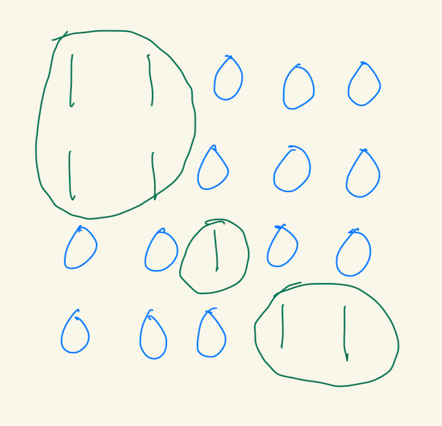

During a past interview, I was subjected to LeetCode challenges. In this post, I'll provide an overview of one of the problems from that interview, which was LeetCode 200. Number of Islands in Python.


## Problem
Given an m x n 2D binary grid which represents a map of '1's (land) and '0's (water), return the number of islands.

An island is surrounded by water and is formed by connecting adjacent lands horizontally or vertically. You may assume all four edges of the grid are all surrounded by water.

**Example 1:**

Input: 
```
grid = [
  ["1","1","1","1","0"],
  ["1","1","0","1","0"],
  ["1","1","0","0","0"],
  ["0","0","0","0","0"]
]
```
Output: 1

**Example 2:**

Input: 
```
grid = [
  ["1","1","0","0","0"],
  ["1","1","0","0","0"],
  ["0","0","1","0","0"],
  ["0","0","0","1","1"]
]
```
Output: 3

Constraints:
* m == grid.length
* n == grid[i].length
* 1 <= m, n <= 300
* grid[i][j] is '0' or '1'.

## How does this Relate to Data Science?
The Number of Islands problem relates to data science in the context of graph theory and connectivity analysis, which are important in various data science applications. 

## Overall
The 2D grid map can be treated as a undirected graph. Each cell in the grid represents a node, and edges exist between nodes if they are horizontally or vertically adjacent and both are land ('1'). The goal is to count the number of connected components in the graph (islands).



## Breadth-first Search (BFS) Solution
BFS uses a queue to explore nodes level-by-level, starting from a given node and exploring all its neighbors before moving to the next level. This ensures all nodes at the same distance from the start are explored before proceeding further.

Example of BFS for Number of Islands:
1. Initialize a set to keep track of the visited land nodes, so that we don't process the same land node multiple times. In Python, we can use `set()`.
2. Initialize a queue and add a starting land node that is not in the visited land nodes set. In Python, we can use `collections.deque()`, which is a double-ended queue implementation. 
3. While the queue is not empty:
  * Dequeue the land node at the front of the queue by using `queue.popleft()`.
  * Process the land node by looking at the horizontally and vertically adjacent nodes within the bounds of the grid.
  * If an adjacent node is a land node and not in the visited set, add it to the queue and the visited set. 
4. Repeat this until the queue is empty.
5. Increment the number of islands by one.
6. Repeat this for all land nodes in the grid that are not in the visited set. Each time a new unvisited land node is found, it indicates the start of a new island.

## Depth-first Search (DFS) Solution
DFS uses a stack (explicitly or via recursion) to explore nodes by going as deep as possible along each branch before backtracking. This ensures each branch is fully explored from the starting node before moving to the next branch.

Example of DFS for Number of Islands:
1. Initialize a set to keep track of the visited land nodes, so that we don't process the same land node multiple times. In Python, we can use `set()`.
2. Initialize a stack and add a starting land node that is not in the visited land nodes set. In Python, we can use `collections.deque()`, which is a double-ended queue implementation. 
3. While the stack is not empty:
  * Pop the land node at the top of the stack by using `stack.pop()`.
  * Process the land node by looking at the horizontally and vertically adjacent nodes within the bounds of the grid.
  * If an adjacent node is a land node and not in the visited set, add it to the stack and the visited set. 
4. Repeat this until the stack is empty.
5. Increment the number of islands by one.
6. Repeat this for all land nodes in the grid that are not in the visited set. Each time a new unvisited land node is found, it indicates the start of a new island.

## Full Code
```
import collections
from typing import List


class Solution:
    def get_num_islands(self, grid: List[List[str]], method: str = 'bfs') -> int:
        if not grid:
            return 0
        
        rows, cols = len(grid), len(grid[0])
        visited = set()
        num_islands = 0

        def perform_bfs(row: int, col: int) -> None:
            q = collections.deque()
            visited.add((row, col))
            q.append((row, col))

            while q:
                row, col = q.popleft()
                directions = [[1, 0], [-1, 0], [0, 1], [0, -1]]

                for direction_row, direction_col in directions:
                    r, c = row + direction_row, col + direction_col
                    if (r in range(rows) and c in range(cols) and
                            grid[r][c] == '1' and (r, c) not in visited):
                        q.append((r, c))
                        visited.add((r, c))
                        
        def perform_dfs(row: int, col: int) -> None:
            s = collections.deque()
            visited.add((row, col))
            s.append((row, col))

            while s:
                row, col = s.pop()
                directions = [[1, 0], [-1, 0], [0, 1], [0, -1]]

                for direction_row, direction_col in directions:
                    r, c = row + direction_row, col + direction_col
                    if (r in range(rows) and c in range(cols) and
                            grid[r][c] == '1' and (r, c) not in visited):
                        s.append((r, c))
                        visited.add((r, c))
        
        for row in range(rows):
            for col in range(cols):
                if grid[row][col] == '1' and (row, col) not in visited:
                    if method == 'bfs':
                        perform_bfs(row, col)
                    elif method == 'dfs':
                        perform_dfs(row, col)
                    else:
                        raise ValueError("Invalid method. Use 'bfs' or 'dfs'.")
                    num_islands += 1
                
        return num_islands


if __name__ == "__main__":
    # No grid
    grid_1 = []
    
    # Grid with single water cell
    grid_2 = [["0"]]
    
    # Grid with single land cell
    grid_3 = [["1"]]
    
    # Grid with alternating land and water cells, forming multiple small islands
    grid_4 = [["1", "0", "1"],
              ["0", "1", "0"],
              ["1", "0", "1"]]
    
    # Grid where a single island has a hole of water in the center
    grid_5 = [["1", "1", "1"],
              ["1", "0", "1"],
              ["1", "1", "1"]]
    
    # Random grid
    grid_6 = [["1","1","0","0","0"],
              ["1","1","0","0","0"],
              ["0","0","1","0","0"],
              ["0","0","0","1","1"]]
    
    soln = Solution()
    
    assert soln.get_num_islands(grid_1) == 0, "Error grid_1"
    assert soln.get_num_islands(grid_2) == 0, "Error grid_2"
    assert soln.get_num_islands(grid_3) == 1, "Error grid_3"
    assert soln.get_num_islands(grid_4) == 5, "Error grid_4"
    assert soln.get_num_islands(grid_5) == 1, "Error grid_5"
    assert soln.get_num_islands(grid_6) == 3, "Error grid_6"

    print("All test cases passed!")
    
    # BFS
    # Time complexity is O(M×N) where M is the number of rows and N is the number of columns
    # Space complexity is worst case O(min(M,N))
    
    # DFS
    # Time complexity is O(M×N) where M is the number of rows and N is the number of columns
    # Space complexity is worst case O(MxN)
```
